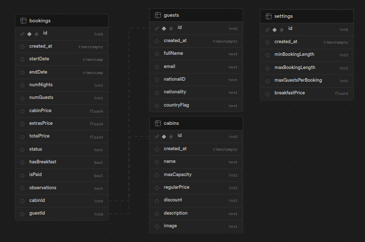
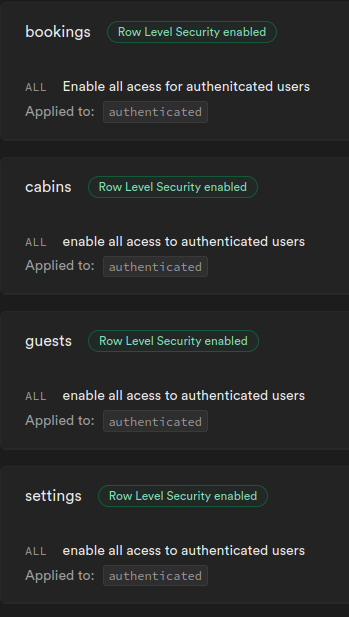

# The Wild Oasis

[](https://github.com/YourUsername/the-wild-oasis/blob/master/README.pl.md)

### Opis

Ta aplikacja internetowa służy jako panel sterowania dla fikcyjnego hotelu. Umożliwia wżielu użytkownikom zarządzanie rónymi aspektami hotelu, w tym informacjami o gościach, rezerwacjami, zarobkami oraz dostępnością pokoi.

Została zbudowana w ramach [kursu](https://www.udemy.com/course/the-ultimate-react-course/?couponCode=ST22FS22724) i zmodyfikowana przy użyciu TypeScript.

### Demo

[Link do strony](https://the-wild-oasis-ts.vercel.app/)

### Funkcje

- Zarządzanie Użytkownikami: Administratorzy mogą tworzyć i zarządzać kontami użytkowników dla członków personelu.
- Panel Sterowania: Zapewnia przegląd aktualnych gości, rezerwacji, zarobków hotelu oraz zajętości pokoi.
- Zarządzanie Rezerwacjami: Personel może tworzyć, edytować i potwierdzać rezerwacje. Rezerwacje można oznaczyć jako zameldowane, gdy goście przybywają.
- Zarządzanie Pokojami: Personel może dodawać lub usuwać kabiny/pokoje z systemu, zapewniając dokładną dostępność pokoi.
- Strona Ustawień: Administratorzy mogą modyfikować globalne informacje specyficzne dla hotelu, takie jak minimalna liczba nocy czy cena śniadania.
- Bezpieczeństwo: Wdraża środki takie jak uwierzytelnianie i autoryzacja użytkowników.

### Użyte Technologie

- Vite: Szybkie narzędzie do budowania nowoczesnych aplikacji jednostronicowych.
- React: Biblioteka JavaScript do tworzenia interfejsów użytkownika.
- TypeScript: Rozszerzenie języka JavaScript dla poprawy jakości kodu i produktywności programisty.
- Styled Components: Biblioteka CSS-in-JS do stylizacji komponentów React.
- React Query: Zapewnia narzędzia do zarządzania, buforowania i synchronizowania stanu serwera w aplikacjach React.
- React Hook Form: Ułatwia tworzenie formularzy w React.
- Supabase: Narzędzie backend as a service open-source, dostarczające usługi uwierzytelniania, funkcje bazy danych i przesyłanie plików.
- React Hot Toast: Biblioteka powiadomień tostowych dla aplikacji React.

### Instalacja

Sklonuj repozytorium lokalnie

```bash
git clone https://github.com/Karo1808/the-wild-oasis.git
```

Zainstaluj wymagane zależności

```bash
npm install
```

Utwórz plik .env.local i dodaj następujące zmienne środowiskowe

```bash
VITE_SUPABASE_KEY=
VITE_SUPABASE_URL=
```

Utwórz tabele w supabase



Zezwól na zabezpieczenia na poziomie wiersza na podstawie obraka poniżej



Utwórz kubełki przechowywania w Supabase

```bash
avatars
cabing-images
```

Run the website locally

```bash
npm run dev
```
